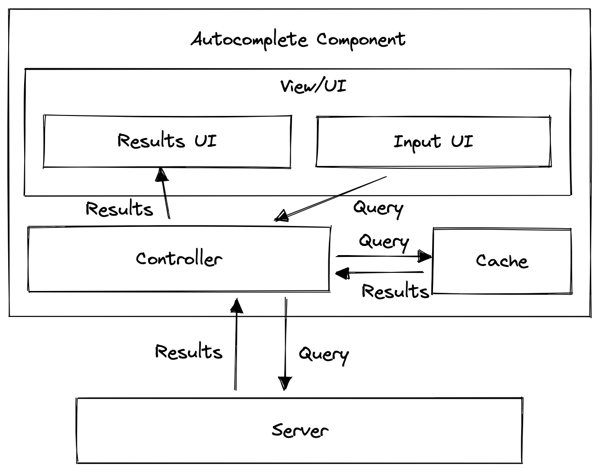

# Requirement Exploration

Design an autocomplete UI component that allows users to enter a search term into a text box, a list of search results appear in a popup and the user can select a result.

Some real-life examples where you might have seen this component in action:

- Google's search bar on google.com where you see a list of primarily text-based suggestions.
- Facebook's search input where you see a list of rich results. The results can be friends, celebrities, groups, pages, etc.

A back end API is provided which will return a list of results based on the search query.

### Requirements

- The component is generic enough to be usable by different websites.
- The input field UI and search results UI should be customizable.

## What kind of result should be supported

Text, image and media are the most common type, but we can't anticipate all

## Device supported

Laptop, tablet, mobile

## Do we need to support fuzzy search

We can explore if have time

## Architecture / high level design



## Component responsibilities

- **Input Field:** Handle user inpur and passes to the controller
- **Results(UI):**
  - Receive results from the controller and present to the user
  - Handle user selection and informs to the controller which input was selected
- **Cache:** Stores the results for previous queries so that the controller can check if sending a request to the server.
- **Controller:**
  - The "brain" of the whole component, similar to the Controller in the Model View Controller (MVC) pattern. All the components in the system interact with this component.
  - Passes user input and results between components.
  - Fetches results from the server if the cache is empty for a particular query.

## Data Model

- **Controller**
  - Props/options exposed via the component API
  - Current search string
- **Cache**
  - Initial results
  - Cached results
  - Refer to section below for cache data model design

## Data model

- Controller
  - Props/options exposed via the component API
  - Current search string
- Cache
  - Initial results
  - Cached results
  - Refer to section below for cache data model design

## API

### Client

**Basic API**

- **Number of results:** The number of results to show in the list of results.
- **API URL:** The URL to hit when a query is made. For an autocomplete use case, queries are made as the user types.
- **Event listeners:** `'input'`, `'focus'`, `'blur'`, `'change'`, `'select'` are some of the common events which developers might want to respond to (possibly log user interactions), so adding hooks for these events would be helpful.

**Advance API**

- **Minimum query length:** There will likely be too many irrelevant results if the user query is too short as it is not specific enough. We might only want to trigger the search when there's a minimum number of characters typed in, possibly 3 or more.
- **Debounce duration**: Triggering backend API when the user stops typing for a 300ms.
- **API timeout duration:** How long we should be waiting for a response to determine that the search has timed out and we can display an error.
- **Cache-related:** Detail in cache section below
  - Initial results
  - Results source: network only/network and cache/cache only
  - Function to merge results from server and cache
  - Cache duration

### Server

- `query`: The actual search query
- `limit`: Number of results in one page
- `pagination`: The page number

## Optimization and deep dive

### Network

- **Handling concurrent requests/race conditions**

  1. Attach a timestamp to each request to determine the latest request and only display the results of the latest request (not the latest response!). Discard the response of irrelevant queries.
  2. Save the results in an object/map, keyed by the search query string and only present the results corresponding to the input value in the search input.

  Options 2 is better

  TODO: Consider typo for historical keystroke

### Failed request and retries

In case the server is indeed offline and we are concerned about overloading the server, we could use an exponential backoff strategy.

### Offline usage

- Read purely from cache. Obviously this is not very useful if the cache is empty.
- Indicate that there's no network connection somewhere in the component.

### Cache

**Cache Structure**

1. **Hash map with search query as key and results as value.** This is the most obvious structure for a cache, mapping the string query to the results. Retrieving the results is super simple and can be obtained in O(1) time just by looking up whether the cache contains the search term as a key.

   ```Javascript
   const cache = {
     fa: [
       { type: 'organization', text: 'Facebook' },
       {
         type: 'organization',
         text: 'FasTrak',
         subtitle: 'Government office, San Francisco, CA',
       },
       { type: 'text', text: 'face' },
     ],
     fac: [
       { type: 'organization', text: 'Facebook' },
       { type: 'text', text: 'face' },
       { type: 'text', text: 'facebook messenger' },
     ],
     face: [
       { type: 'organization', text: 'Facebook' },
       { type: 'text', text: 'face' },
       { type: 'text', text: 'facebook stock' },
     ],
     faces: [
       { type: 'television', text: 'Faces of COVID', subtitle: 'TV program' },
       { type: 'musician', text: 'Faces', subtitle: 'Rock band' },
       { type: 'television', text: 'Faces of Death', subtitle: 'Film series' },
     ],
     // ...
   }
   ```

   However, see that there are lots of duplicate results especially if we don't do any debouncing as the user is typing and we fire one request per keystroke. This results in the page consuming lots of memory for the cache.

2. **List of results.** Alternatively, we could save the results as a flat list and do our own filtering on the front end. There will not be much (if any) duplication of results.
   ```Javascript
    const results = [
           { type: 'company', text: 'Facebook' }, // fa
           {
             type: 'organization', // fa
             text: 'FasTrak',
             subtitle: 'Government office, San Francisco, CA',
           },
           { type: 'text', text: 'face' }, // fac
           { type: 'text', text: 'facebook messenger' }, // fac
           { type: 'text', text: 'facebook stock' }, // fac
           { type: 'television', text: 'Faces of COVID', subtitle: 'TV program' }, // faces
           { type: 'musician', text: 'Faces', subtitle: 'Rock band' }, // faces
           { type: 'television', text: 'Faces of Death', subtitle: 'Film series' }, // faces
         ]
   ```
   However, this is not ideal in practice because we have to do filtering on the client side. This is bad for performance and might end up blocking the UI thread and is especially evident on large data sets and slow devices. The ranking order per result might also be lost, which is not ideal.
3. **Normalized map of results.** We take inspiration from [normalizr](https://github.com/paularmstrong/normalizr/tree/master/docs) and structure the cache like a database, combining the best traits of the earlier approaches - fast lookup and non-duplicated data. Each result entry is one row in the "database" and is identified by a unique ID. The cache simply refers to each item's ID.

   ```Javascript
   // Store results by ID to easily retrieve the data for a specific ID.
     const results = {
       1: { id: 1, type: 'organization', text: 'Facebook' },
       2: {
         id: 2,
         type: 'organization',
         text: 'FasTrak',
         subtitle: 'Government office, San Francisco, CA',
       },
       3: { id: 3, type: 'text', text: 'face' },
       4: { id: 4, type: 'text', text: 'facebook messenger' },
       5: { id: 5, type: 'text', text: 'facebook stock' },
       6: {
         id: 6,
         type: 'television',
         text: 'Faces of COVID',
         subtitle: 'TV program',
       },
       7: { id: 7, type: 'musician', text: 'Faces', subtitle: 'Rock band' },
       8: {
         id: 8,
         type: 'television',
         text: 'Faces of Death',
         subtitle: 'Film series',
       },
     };

     const cache = {
       fa: [1, 2, 3],
       fac: [1, 3, 4],
       face: [1, 3, 5],
       faces: [6, 7, 8],
       // ...
     };
   ```

   **Which structure to use?**

- **Short-lived websites:** If the component is being used on a page which is short-lived (e.g. Google search), option 1 would be the best. Even though there is duplicated data, the user is unlikely to use search so often that memory usage becomes an issue. The cache is being cleared/reset when the user clicks on a search result anyway.
- **Long-lived websites:** If this autocomplete component is used on page which is a long-lived single page application (e.g. Facebook website), then option 3 might be viable. However, do also note that caching results for too long might be a bad idea as stale results take up memory without being useful.

**Initial Results**

- **Google:** Popular search queries today (current affairs, trending celebrities, latest happenings) and historical searches
- **Facebook:** Historical searches.
- **Stock/crypto/currency exchanges:** Historical searches or trending stocks

**Caching Strategy**

- **Google:** Google search results don't update that often, so the cache is useful and can live for long (hours?).
- **Facebook:** Facebook search results are updated moderately often, so a cache is useful but entries should be evicted every now and then (half an hour?).
- **Stock/currency exchanges:** Exchanges with an autocomplete for stock ticker symbols/currency showing the current price in the results might not want to cache at all because the prices change every minute when the markets are open.

### Performance

**Loading speed**
We can even go one step further and use cached results for future results if there's a match.

**Debouncing/throttling**
By limiting the number of network requests that can be fired, we reduce server payload and CPU processing.

**Memory usage**
Long-lived pages might have autocomplete components which accumulate too many results in the cache and hog memory. Purging the cache and freeing up memory is essential for such pages. The purging can be done when the browser is idle or total memory/number of cache entries exceed a certain threshold.

**Virtualized lists**
If the results contains many items (order of hundreds and thousands), rendering that many DOM nodes in the browser would cost lots of memory and slow down the browser.

### User experience

**Autofocus**
Add the autofocus attribute to your input if it's a search page (like Google) and you're very certain that the user has a high intention to use the autocomplete when it is present on the screen.

**Handle different states**

- Loading: Show spinner when there's a background request.
- Error: Show an error message with a retry request button.
- No network: Show an error message that there's no network available.

**Handle long strings**
Long text in the result items should be handled appropriately, usually via truncating with an ellipsis or wrapping nicely. The text should not overflow and appear outside the component.

**Mobile-friendliness**

- Each result item should be large enough for user to tap on if used on mobile.
- Set helpful attributes for mobile: `autocapitalize="off"`, `autocomplete="off"`, `autocorrect="off"`, `spellcheck="false"` so that the browser suggestions do not interfere with the user's search.
  **Keyboard interaction**
- Users should be able to use the component and focus on the autocomplete suggestions just via their keyboard. Read more under the Accessibility section.
- Add a global shortcut key to let the user easily focus on the autocomplete input. A common keyboard shortcut is the / (forward slash) key, which is used by Facebook, X and YouTube.

**Typos in search**

Fuzzy searches can be used if the filtering is purely done on the client side by computing edit distance (e.g. [Levenshtein distance](https://en.wikipedia.org/wiki/Levenshtein_distance)) between the search query and the results and selecting the ones with the smallest edit distance. For searches done on the server-side, we can send the query as-is and have the fuzzy matching be done on the server.

**Query results positioning**
The list of autocomplete suggestions typically appear below the input. However, if the autocomplete component is at the bottom of the window, then there's insufficient space to fully display the results. The suggestions can be made aware of its positioning on the page and render above the input if there's no space to show it below the input.

### Accessibility

**Screen readers**

- Use semantic HTML or use the right aria roles if using non-semantic HTML. Use `<ul>`, `<li>` for building list items or` role="listbox"` and `role="option"`.
- `aria-label` for the `<input>` because there usually isn't a visible label.
- `role="combobox"` for the `<input>`.
- `aria-haspopup` to indicate that the element can trigger an interactive popup element.
- `aria-expanded` to indicate whether the popup element is currently displayed.
- Mark the results region with `aria-live` so that when new results are shown, screen reader users are notified.
- `aria-autocomplete` to describe the type of autocompletion interaction model the combobox will use when dynamically helping users complete text input, whether suggestions will be shown as a single value inline (`aria-autocomplete="inline"`) or in a collection of values (`aria-autocomplete="list"`)
  - Google uses aria-autocomplete="both" while Facebook and X use `aria-autocomplete="list"`.

**Keyboard interaction**

- Hit enter to perform a search. You can get this behavior for free by wrapping the `<input>` in a `<form>`.
- Up/down arrows to navigate the options, wrapping around when the end of the list is reached.
- Escape to dismiss the results popup if it is visible.
- More in the [WAI ARIA Combo Box](https://www.w3.org/WAI/ARIA/apg/patterns/combobox/) practices.

## Comparing Google, Facebook and X

| Syntax    | Description |
| --------- | ----------- |
| Header    | Title       |
| Paragraph | Text        |

| HTML Attribute        | Google       | Facebook            | X                |
| --------------------- | ------------ | ------------------- | ---------------- |
| HTML Element          | `<textarea>` | `<input>`           | `<input>`        |
| type                  | `"text"`     | "search"            | `"text"`         |
| Within `<form>`       | Yes          | No                  | Yes              |
| autocapitalize        | `"off"`      | Absent              | "sentence"       |
| autocomplete          | `"off"`      | `"off"`             | `"off"`          |
| autocorrect           | `"off"`      | Absent              | `"off"`          |
| autofocus             | Present      | Absent              | Present          |
| placeholder           | Absent       | `"Search Facebook"` | ` "Search"`      |
| role                  | `"combobox"` | Absent              | `"combobox"`     |
| spellcheck            | ` "false"`   | ` "false"`          | ` "false"`       |
| aria-activedescendant | Present      | Absent              | Present          |
| aria-autocomplete     | `"both"`     | ` "list"`           | ` "list"`        |
| aria-expanded         | Present      | Present             | Present          |
| aria-haspopup         | ` "false"`   | Absent              | Absent           |
| aria-invalid          | Absent       | ` "false"`          | Absent           |
| aria-label            | `"Search"`   | `"Search Facebook"` | `"Search query"` |
| aria-owns             | Present      | Absent              | Present          |
| dir                   | Absent       | `"ltr"/"rtl"`       | `"auto"`         |
| enterkeyhint          | Absent       | Absent              | `"search"`       |

## References

[The Life of a Typeahead Query](https://engineering.fb.com/2010/05/17/web/the-life-of-a-typeahead-query/)
[Building an accessible autocomplete control](https://adamsilver.io/blog/building-an-accessible-autocomplete-control/)
